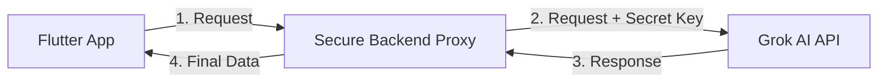

# Production Deployment Plan - Secure AI Integration

Transition from direct client-side API calls to a secure backend architecture for production deployment. This ensures your Grok API key is never exposed to users or hackers.

## The Security Requirement
For **Deployment**, we **MUST NOT** include the API key in the Flutter app. If we do:
1. Hackers can steal your key.
2. They can use your Grok credits and cost you money.
3. Your account could be banned.

## Proposed Architecture (Secure)

## Implementation Options

### Option A: Firebase Cloud Functions (Recommended)
- **Pros**: Scales automatically, secure, part of your existing Firebase project.
- **Cons**: Requires Firebase **Blaze Plan** (Pay-as-you-go).

### Option B: Custom Node.js/Python Backend
- **Pros**: Full control, can be hosted for free/cheap on platforms like Render or Railway.
- **Cons**: More setup time.

## Immediate Actions for "Ready for Deployment"

1.  **Remove Key from App**: I will create a production-ready `SecureGrokAiService` that calls a URL instead of having a key inside.
2.  **Toggle Switch**: Add a way to switch between "Demo Mode" (with key) and "Production Mode" (secure).

## User Review Required
- **Which path do you choose for deployment?**
    - "I will upgrade to Firebase Blaze plan for Cloud Functions."
    - "I want to use a separate small server (Node.js)."
