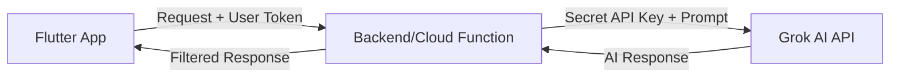

# Security Plan - AI API Key Protection

To prevent security risks and unauthorized use of your API keys, we must follow industry best practices for mobile application development.

## The Problem: Client-Side Exposure
Hardcoding an API key (like Grok or OpenAI) directly in the Flutter code is dangerous because:
1. **Decompilation**: Users or malicious actors can reverse-engineer your APK/IPA and extract the key.
2. **Quota Exhaustion**: If your key is stolen, others can use your credits, leading to unexpected costs.
3. **Revocation**: If a key is compromised, you must push a new app update to all users to change it.

## The Solution: Backend Proxy (Recommended)

The standard way to handle this is to use a **Server-Side Proxy**. Instead of the app calling Grok directly, the flow becomes:

### Options for Implementation:

| Option | Pros | Cons |
| :--- | :--- | :--- |
| **Firebase Cloud Functions** | Seamless integration with your existing Firebase project. Easy to secure with Firebase Auth. | Requires Firebase "Blaze" (pay-as-you-go) plan. |
| **Custom Backend (Node/Python)** | Full control, can be hosted anywhere. | More infrastructure to manage. |
| **Environment Variables (Obfuscated)** | Better than hardcoding, free. | **NOT 100% SECURE**. Expert hackers can still find keys in the binary. |

## Proposed Next Steps

1. **Verify Firebase Plan**: Are you on the Firebase "Blaze" plan? If so, we can implement a Cloud Function.
2. **Mocking for Development**: While we decide on the backend, I can create a service class in Flutter that *simulates* the network call. This allows us to build the UI logic today and swap in the secure backend call later without changing the UI code.

> [!IMPORTANT]
> For delivery to clients, we **must** use the Backend Proxy approach to ensure the API key remains secret.
